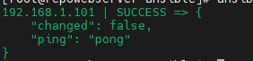
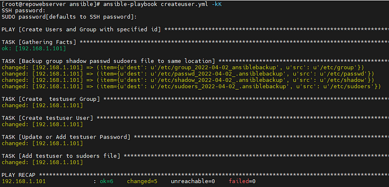
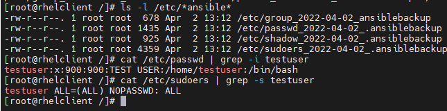

# Ansible ile Sudo Yetkili Kullanıcı Oluşturma


Ansible, Red Hat’in open-source sunmuş olduğu IT Otomasyon aracı ile hedefteki sunuculara tek tek bağlanmadan tüm yönetim ve yapılandırma işlemlerinin otomatikleştirilmesine olanak sağlamaktadır.   
Aşağıda paylaşmış olduğum örnekte hedef sunucuda specific uid ve guid ile kullanıcı oluşturmasını sağlamaktadır.

Ansible’in kullanıcı modülü ile hedef sunucuda kullanıcı oluşturabilir hesapların parolaları değiştirilebilir, gruplara atanabilir veya expiration date gibi benzeri tüm kullanıcı işlemleri yapabilir.

Kullanılan başlıca parametreler;

>[!TIP|style:flat]
> #create\_home - Yes/No seçeneği ile oluşturulan kullanıcı için home  klasörü oluşturulmasını sağlar. Verilmez ise default oluşturur  
> #name - Oluşturulacak, silinecek veya değiştirilecek kullanıcı adı  
> #password - Belirtilen bir kullanıcı için bir parola ayarlar.  
> #uid - Tanımlanmış bir kullanıcının UID'sini ayarlar. Örn: uid: 900  
> #shell - Bir kullanıcı için varsayılan kabuğu ayarlar. Verilemez ise #default bash olarak ekler. Örneğin : /bin/bash  
> #group - Belirtilen bir kullanıcı için birincil grubu tanımlar. Örn: #group: test  
> #home - Oluşturulacak olan kullanıcı için home klasörünün yerini belirtir

Yapılan örnekte kullanılan ansible versiyonu:

```bash
[root@ansible]# ansible-playbook — version
ansible-playbook 2.4.2.0
```

---

```bash
# vi create_user.yml---
- name: Create Users and Group with specific id
  gather_facts: yes 
  #backup modülü için tarihi dosya adına eklemesi için gerekli
  become_user: root
  become_method: sudo
  hosts: servers
  vars:
   - user: testuser
  tasks:
    - name: Backup group shadow passwd sudoers file to same location #İşlem yapılacak dosyaların önce bir backup'ını alalım :-)
      copy: 
       src: "{{ item.src }}" 
       dest: "{{ item.dest }}"
       remote_src: yes
      with_items:
       - { src: '/etc/group', dest: '/etc/group_{{ansible_date_time.date}}_ansiblebackup' }
       - { src: '/etc/passwd', dest: '/etc/passwd_{{ansible_date_time.date}}_.ansiblebackup' }
       - { src: '/etc/shadow', dest: '/etc/shadow_{{ansible_date_time.date}}_.ansiblebackup' }
       - { src: '/etc/sudoers', dest: '/etc/sudoers_{{ansible_date_time.date}}_.ansiblebackup' }
  
    #Kullanıcı için Önce Grup Oluşturulur
    - name: Create {{user}} Group 
      group:
       name: "{{user}}"
       state: present
       gid: 900- name: Create {{user}} User 

  #Kullanıcı oluşturma ve kullanıcıyı oluşturulan gruba atama
      user:
       name: "{{user}}"
       comment: Test User
       uid:900
       update_password: always   
       #always kullanıcı varolsa bile parolasını değiştirir. "on_create" kullanırsanız yeni kullanıcılar için password oluşturur.
       password: "{{ '123456'|password_hash('sha512') }}"
       group: "{{user}}"
       state: present- name: Add {{user}} to sudoers file 

  #Kullanıcıya sudo yetkisi verir
      lineinfile:
        path: /etc/sudoers
        state: present
        regexp: "'^{{user}}'"
        line: '{{user}} ALL=(ALL) NOPASSWD: ALL'
        validate: 'visudo -cf %s'
```

---

Bu örnekte kullanıcı oluştururken specific uid ve gid ihtiyacı olduğundan YML içerisinde uid ve gid parametreleri kullandım. İhtiyacınız yok ise satırı ‘#’’leyebilirsiniz. Default olarak sistem tarafından 1000'den başlayarak oluşturur.

Ansible Host File  
hosts bölümünde tanımladığımız servers için inventory tanımladığımız config file

```bash
vi /etc/ansible/hosts
  [servers]
  ip
  test.server.com
  test2.server.com
```

---

Erişim Kontrolü

```bash
ansible -m ping servers
```



#Hazırladığımız yml dosyasını çalıştırma

Not: Hedef sunucuya ssh password ve sudo password için -kK parametreleri kullanıyorum. Direk sshkey ile root bağlandıysanız bu parametre gerekli değil.

```bash
ansible-playbook create_user.yml -kK
```



Hedef sunucuda kontrollerimizi sağlayalım



**Not:Password komut içerisinde vermek istenirse**

```bash
- name: Update or Add {{user}} Password
      user:
        name: "{{user}}"
        update_password: always
        password: "{{ upassword|password_hash('sha512') }}"
        
```

```bash
#ansible-playbook createuser.yml — extra-vars upassword=123 -kK
```