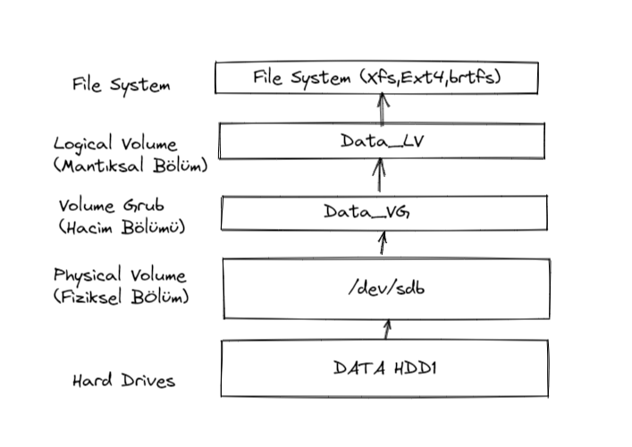

# LVM (Logical Volume Management)

LVM Linux çekirdeği için bir Mantıksal Hacim Yöneticisi’dir. LVM kullanarak depolama alanı soyut hale getirilebilir, düzenlemesi daha kolay olan “sanal disk bölümleri” oluşturulabilir.

LVM birden fazla diski tek bir disk bölümü olarak kullanılmasına olanak sağlayan ve disk yönetimi işlemlerinde büyük fayda sağlayan bir teknolojidir.

LVM ile disk alanının yetersiz kaldığı durumlarda LVM ile oluşturulan disk volume grupları, kolaylıkla yeni disk veya disk bölümleri ilave edebilir, çıkarabilir mevcut ihtiyaçlara göre disk alanı şekillendirebilir. Bu işlemleri yaparken sisteminizi restart etmek veya uygulamalarınızı durdurmandan gerçekleştirebilirsiniz.

Örnek olarak aşağıda 5 fiziksel diskten oluşan tek bir data\_vg volume grubu (hacim) oluşturulmuş ve altında logical volumlerin oluşturulduğu bir disk yapısı görülmektedir.


---



Yapacağımız örneğimizde sistemimize ;
1. **fdisk** ile Partition oluşturulması ve LVM taglenmesi
2.  20GB bir disk ekleyip bu disk altında **PV** (physical Volume) oluşturacağız
3.  Oluşturduğumuz PV'den **data\_vg** VG (Volume Group) oluşturacağız.
4.  **data\_vg** altında **data\_lv** LV (Logical Volume ) oluşturacağız
5.  **data\_lv** oluşturulduktan sonra XFS file system oluşturup sisteme mount edeceğiz

> Dikkat !! Disk üzerinde hatalı yapacağınız tüm işlemler sisteminize ve disk yapısına zarar verebilir. İlk defa öğreniyorsanız test sanal sunucunuzda bu işlemleri test etmenizi öneririz.

> Komutlar ve Bilgiler
> 
> pvcreate = Fiziksel bölüm oluşturulmasını sağlar
> 
> pvdisplay = Sistemdeki tüm fiziksel bölümlerin bilgilerini gösterir
> 
> pvscan = Eğer sistemde PV gözükmüyorsa taranmasını sağlar
> 
> vgcreate = Hacim gurubu oluşturulmasını sağlar
> 
> vgdisplay = Sistemdeki tüm hacim gruplarını listeler ve detaylı bilgi gösterir
> 
> vgscan = Eğer sistemde vg gözükmüyors taranmasını sağlar
> 
> lvcreate = Mantıksal bir oluşturulmasını sağlar
> 
> lvdisplay = Sistemdeki tüm mantıksal birimleri listeler ve detaylı bilgi gösterir
> 
> lvscan =  Eğer sistemde mantıksal bir birim gözükmüyosa taranmasını sağlar
> 
> mkfs.xfs = Oluşturulan  disk üzerinde file system oluşturulmasını sağlar

---

###### 1\. Physical Volume Oluşturulması

Öncelikle sistemimizdeki disklere lsblk komutu ile kontrol ediyoruz. Sistemize /dev/sdb diskimizin eklendiğini görüyoruz

```bash
[root@akf ~]# lsblk
NAME          MAJ:MIN RM  SIZE RO TYPE MOUNTPOINT
sda             8:0    0 20.2G  0 disk
├─sda1          8:1    0    1G  0 part /boot
└─sda2          8:2    0 19.2G  0 part
  ├─rhel-root 253:0    0 17.2G  0 lvm  /
  └─rhel-swap 253:1    0    2G  0 lvm  [SWAP]
sdb             8:16   0   20G  0 disk
sr0            11:0    1 1024M  0 rom
```

> Eklenen diski **dmesg** ile kontrol edebilirsiniz veya disk henüz gözükmüyorsa  aşağıdaki komut ile sistemin taranması tetiklenebilir.
> 
> ```bash
> echo "- - -" | tee /sys/class/scsi_host/host*/scan
> ```

pvcreate komutu ile fiziksel bölüm oluşturulur.  pvdisplay ile oluşturmuş olduğumuz bölümü kontrol edelim.


> [!TIP|style:flat]
>  

```bash
[root@akf ~]# pvcreate /dev/sdb
  Physical volume "/dev/sdb" successfully created.

[root@akf ~]# pvdisplay
  --- Physical volume ---
  PV Name               /dev/sda2
  VG Name               rhel
  PV Size               19.18 GiB / not usable 0
  Allocatable           yes
  PE Size               4.00 MiB
  Total PE              4911
  Free PE               1
  Allocated PE          4910
  PV UUID               b1ZPw8-jctY-BUC8-BDfQ-hVaL-fEqx-kBIk14

  --- Physical volume ---
  PV Name               /dev/sdb
  VG Name               data_vg
  PV Size               20.00 GiB / not usable 4.00 MiB
  Allocatable           yes
  PE Size               4.00 MiB
  Total PE              5119
  Free PE               5119
  Allocated PE          0
  PV UUID               rK0tqB-j1BP-ZFuR-zdbE-16tx-TZAW-NZlQFc

[root@akf ~]# pvs
  PV         VG   Fmt  Attr PSize  PFree
  /dev/sda2  rhel lvm2 a--  19.18g  4.00m
  /dev/sdb        lvm2 ---  20.00g 20.00g
```

Fiziksel bölüm oluşturuldu Volume Group oluşturalım

###### 2\. Volume Group Oluşturulması

vgcreate  komutu ile data\_vg isminde oluşturmuş olduğumuz pv 'den volume grubu oluşturuyoruz.

 vgdisplay ile oluşturmuş olduğumuz bölümü kontrol edelim.

```bash
[root@akf ~]# vgcreate data_vg /dev/sdb
  Volume group "data_vg" successfully created
[root@akf ~]# vgs
  VG      #PV #LV #SN Attr   VSize   VFree
  data_vg   1   0   0 wz--n- <20.00g <20.00g
  rhel      1   2   0 wz--n-  19.18g   4.00m

[root@akf ~]# vgdisplay data_vg
  --- Volume group ---
  VG Name               data_vg
  System ID
  Format                lvm2
  Metadata Areas        1
  Metadata Sequence No  1
  VG Access             read/write
  VG Status             resizable
  MAX LV                0
  Cur LV                0
  Open LV               0
  Max PV                0
  Cur PV                1
  Act PV                1
  VG Size               <20.00 GiB
  PE Size               4.00 MiB
  Total PE              5119
  Alloc PE / Size       0 / 0
  Free  PE / Size       5119 / <20.00 GiB
  VG UUID               keLNLW-jpzG-X67E-Uyen-5lTb-hpqr-rSx7BK
```

> Volume Grubu oluşturulurken default olarak 4mb bloklar halinde bir disk oluşturulmasını sağlar. Disk yazma hızı gerektiği data disk gruplarında “ -S 16MB” parametresi ile yüksek bloklar içeren disk oluşturabilirsiniz.
> 
> Örneğin dataların 16mb'lık bloklar halinde oluşturur. >  vgcreate -s 16M data\_vg /dev/sdb

###### 3 . Logical Volume Group Oluşturulması

lvcreate komutu ile vgdisplay çıktısında yer alan FREE PE size ile diskin tamamını vererek disk bölümlenmesini oluşturuyoruz. 

PE Hesaplaması

Total PE / 1024 = 5119 / 4 = 19.99609375  (Sisteme yuvarlamadan kaynaklı 20GB olarak göstermekte aynı zamanda lvm kendisi de az miktarda yer kaplıyor, bu yüzden direk +20GB olarak verememekteyiz)

Örneğimizde PE size vererek tüm alanın kullanılmasını sağlıyoruz.  

```bash
  --- Volume group ---
 VG Name               data_vg
 System ID
 Format                lvm2
 Metadata Areas        1
 Metadata Sequence No  1
 VG Access             read/write
 VG Status             resizable
 MAX LV                0
 Cur LV                0
 Open LV               0
 Max PV                0
 Cur PV                1
 Act PV                1
 VG Size               <20.00 GiB
 PE Size               4.00 MiB
 Total PE              5119
 Alloc PE / Size       0 / 0
 Free  PE / Size       5119 / <20.00 GiB
 VG UUID               keLNLW-jpzG-X67E-Uyen-5lTb-hpqr-rSx7BK

[root@akf ~]# lvcreate -l 5119 -n data_lv data_vg
 Logical volume "data_lv" created.
```

Aşağıdaki komut ile istediğiniz kadarlık bir alan oluşturabilir ve sonrasında extend edebilirsiniz.

```bash
# lvcreate -L +15GB -n data_lv data_vg
```

Diğer bir seçenek ise aşağıdaki komut ile de tüm alanın verilmesi sağlanabilir.  

```bash
# lvcreate -l 100%FREE data_lv data_vg
```

###### 3 . Logical Volume Group Oluşturulması

Diskimiz lsblk çıktısında artık gözükmekte  ve bu disk bölümü için file system oluşturup sistemimize mount edelim.

```bash
[root@akf ~]# lsblk
NAME              MAJ:MIN RM  SIZE RO TYPE MOUNTPOINT
sda                 8:0    0 20.2G  0 disk
├─sda1              8:1    0    1G  0 part /boot
└─sda2              8:2    0 19.2G  0 part
 ├─rhel-root     253:0    0 17.2G  0 lvm  /
 └─rhel-swap     253:1    0    2G  0 lvm  [SWAP]
sdb                 8:16   0   20G  0 disk
└─data_vg-data_lv 253:2    0   20G  0 lvm
sr0                11:0    1 1024M  0 rom
```

mkfs.xfs komutu ile oluşturduğumuz alandan bir file sistem oluşturuyoruz. ve diski fstab'a ekleyip mount ediyoruz.

#ext4 fs için mkfs.ext4

```bash
[root@akf ~]# mkfs.xfs /dev/mapper/data_vg-data_lv
meta-data=/dev/mapper/data_vg-data_lv isize=512    agcount=4, agsize=1310464 blks
        =                       sectsz=512   attr=2, projid32bit=1
        =                       crc=1        finobt=0, sparse=0
data     =                       bsize=4096   blocks=5241856, imaxpct=25
        =                       sunit=0      swidth=0 blks
naming   =version 2              bsize=4096   ascii-ci=0 ftype=1
log      =internal log           bsize=4096   blocks=2560, version=2
        =                       sectsz=512   sunit=0 blks, lazy-count=1
realtime =none                   extsz=4096   blocks=0, rtextents=0
```

```bash


vi /etc/fstab

# /etc/fstab
# Created by anaconda on Sat Jan 29 19:43:15 2022
#
# Accessible filesystems, by reference, are maintained under '/dev/disk'
# See man pages fstab(5), findfs(8), mount(8) and/or blkid(8) for more info
#
/dev/mapper/rhel-root   /                       xfs     defaults        0 0
UUID=df722636-9d48-4736-9234-bfb696c366c9 /boot                   xfs     defaults        0 0
/dev/mapper/rhel-swap   swap                    swap    defaults        0 0
################DATA DISK TANIM###########

/dev/mapper/data_vg-data_lv   /data                       xfs     defaults        0 0
```

```bash
[root@akf ~]# cd /
[root@akf /]#
[root@akf /]# mkdir data
[root@akf /]#
[root@akf /]# vi /etc/fstab
[root@akf /]#
[root@akf /]#
[root@akf /]# mount /data
[root@akf /]#
[root@akf /]#
[root@akf /]# df -hT
Filesystem                  Type      Size  Used Avail Use% Mounted on
devtmpfs                    devtmpfs  484M     0  484M   0% /dev
tmpfs                       tmpfs     496M     0  496M   0% /dev/shm
tmpfs                       tmpfs     496M  6.8M  489M   2% /run
tmpfs                       tmpfs     496M     0  496M   0% /sys/fs/cgroup
/dev/mapper/rhel-root       xfs        18G  1.7G   16G  10% /
/dev/sda1                   xfs      1014M  171M  844M  17% /boot
tmpfs                       tmpfs     100M     0  100M   0% /run/user/1000
/dev/mapper/data_vg-data_lv xfs        20G   33M   20G   1% /data
```

Diskimiz artık df çıktısında gözükmekte ve içerisinde veri yazabilir haldeyiz. Bir sonraki yazımızda bu disk grubuna disk ekleyip extend etme işlemlerini yapıyor olacağız.

Teşekkürler.