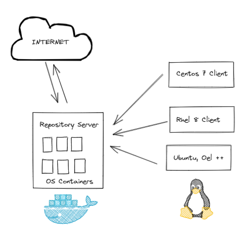
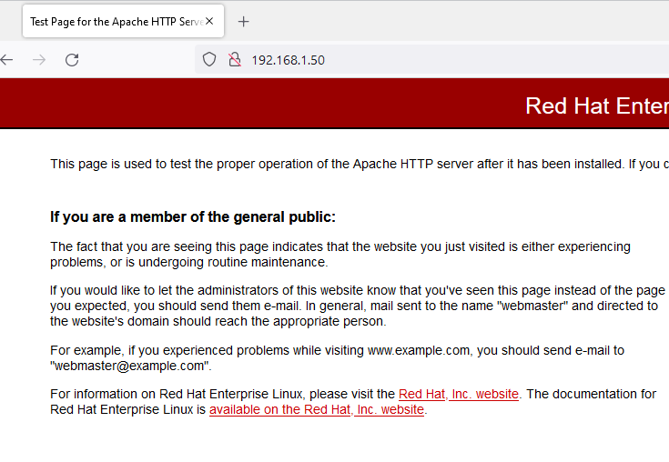

# Disconnected Ortamlar için Repository Server Kurulumu



# **Nedir?**

Günümüzde yönetmekte olduğumuz sunuculara  planlı bir şekilde update etmek artık hayatımızın bir parçası oldu. Eskiden “if running keep runing” sözü günümüz şartlarında tarihe karıştı :=) Neredeyse her gün bir zaafiyet çıkıyor ve sunucularımız düzenli update yapılmadığında ciddi tehlike altında oluyoruz. Yönettiğimiz sunucuların yüzlerce olduğu durumlarda eğer bir patch management uygulamanız yok ise update bazen ciddi yorucu olabiliyor. Bu yazımızda tek bir sunucu ve üzerinde çalıştıracağımız web server ile yönetimimizde olan tüm distroları local networkden nasıl patch işlemi yapacağımıza değineceğiz.

**Neden Local Respository?**

1- Compliance veya zafiyet buluduran sistemlerin update edilmesi için internet erişimi veremediğiniz sunuclara local repodan güncel patch yapılması

2- Sunucuların internete açılması ve sonrasında kapatılması iş yükünün önüne geçilmesi. Bu ihtiyacın ortadan kaldırılması.

3- Test sistemleriniz sonrasında aynı paketlerin Prod sistemlere de yüklenebilmesi (Paket ve versiyon farklılıklarının önüne geçilmesi)

4- Aynı anda 100'dan fazla sunucuya network hızınıza bağlı olarak hızlıca update yapılabilmesi

5- Tek tek sunuculara kurduğunuz bir paket var ise web sunucuza atıp wget ile paketi indirip  tek noktadan kurulabilmesi gibi bir çok madde sıralayabiliriz.

# Gereklilikler

1- Redhat 7 VM  Web Server için

2- Centos 7 VM Client

3- Redhat 8 VM Client

4- Basic Docker bilgisi (Ücresiz açıkkaynakfikirler eğitmi için [buradan](https://egitim.acikkaynakfikirler.com/docker101-bolum1/))

# Kurulum Adımları

1-HTTPD (apache veya nginx) kurulumu

2-Docker container servisinin kurulumu

3-Repo dosyaları için ikinci bir disk eklemesi

4-Minimal OS docker image'larının hazırlanması

5-Repoları indirmek için Script hazırlanması

6-Oluşturulan Image'lardan container oluşturulması

# Kullanılacak Olan IP ve OS Bilgileri ve Yapı

Web Server ve Docker Servisi

IP 192.168.1.50

Web Adresi: http: \\\\192.168.1.50\\data

# 1- HTTPD (Apache veya Nginx Kurulumu)

Yazımızın başında da belirttiğimiz gibi  web serverimizi redhat 7.9 tercih ettiğim için ilgili distro kaynaklarından devam ediyorum. 

> Dilerseniz web serverı da docker container olarak kurabilirsiniz.

> Not: Eğer container içinde redhat 7  ve 8 için de local repository hazırlamak istiyorsanız subscription'a ihtiyacınız var demektir. Redhat'in image'larında subscripton kullanamıyorsunuz. Docker servisininiz koştuğu sunucu redhat ise otomatik olarak aynı  subscription'ı redhat docker imagelarınız içinde kullanabiliyorsunuz. Dolayısı ile web sunucuzu ve docker servisini konumlandıracağınız OS'i doğru belirlemeniz gerekiyor. Redhat içinde test yapacağımızdan dolayı  OS'i redhat 7.9 tercih ediyorum. Sizin ihtiyacınız yok ise herşey docker üzerinde olacağından dolayı distro bağımsız tercih size kalmış.

**yum install httpd**  komutu ile sunucumuza apache web servisini kuruyoruz.

```bash
[root@repo-server /]# yum install httpd
Loaded plugins: product-id, search-disabled-repos, subscription-manager
Resolving Dependencies
--> Running transaction check
---> Package httpd.x86_64 0:2.4.6-97.el7_9.5 will be installed
--> Processing Dependency: httpd-tools = 2.4.6-97.el7_9.5 for package: httpd-2.4.6-97.el7_9.5.x86_64
--> Processing Dependency: /etc/mime.types for package: httpd-2.4.6-97.el7_9.5.x86_64
--> Processing Dependency: libapr-1.so.0()(64bit) for package: httpd-2.4.6-97.el7_9.5.x86_64
--> Processing Dependency: libaprutil-1.so.0()(64bit) for package: httpd-2.4.6-97.el7_9.5.x86_64
--> Running transaction check
---> Package apr.x86_64 0:1.4.8-7.el7 will be installed
---> Package apr-util.x86_64 0:1.5.2-6.el7 will be installed
---> Package httpd-tools.x86_64 0:2.4.6-97.el7_9.5 will be installed
---> Package mailcap.noarch 0:2.1.41-2.el7 will be installed
--> Finished Dependency Resolution

Dependencies Resolved

=====================================================================================================================
 Package                  Arch                Version                          Repository                       Size
=====================================================================================================================
Installing:
 httpd                    x86_64              2.4.6-97.el7_9.5                 rhel-7-server-rpms              1.2 M
Installing for dependencies:
 apr                      x86_64              1.4.8-7.el7                      rhel-7-server-rpms              104 k
 apr-util                 x86_64              1.5.2-6.el7                      rhel-7-server-rpms               92 k
 httpd-tools              x86_64              2.4.6-97.el7_9.5                 rhel-7-server-rpms               94 k
 mailcap                  noarch              2.1.41-2.el7                     rhel-7-server-rpms               31 k

Transaction Summary
=====================================================================================================================
Install  1 Package (+4 Dependent packages)

Total download size: 1.5 M
Installed size: 4.3 M
Is this ok [y/d/N]: y
Downloading packages:
(1/5): apr-1.4.8-7.el7.x86_64.rpm                                                             | 104 kB  00:00:00
(2/5): apr-util-1.5.2-6.el7.x86_64.rpm                                                        |  92 kB  00:00:00
(3/5): httpd-tools-2.4.6-97.el7_9.5.x86_64.rpm                                                |  94 kB  00:00:00
(4/5): httpd-2.4.6-97.el7_9.5.x86_64.rpm                                                      | 1.2 MB  00:00:00
(5/5): mailcap-2.1.41-2.el7.noarch.rpm                                                        |  31 kB  00:00:00
---------------------------------------------------------------------------------------------------------------------
Total                                                                                725 kB/s | 1.5 MB  00:00:02
Running transaction check
Running transaction test
Transaction test succeeded
Running transaction
  Installing : apr-1.4.8-7.el7.x86_64                                                                            1/5
  Installing : apr-util-1.5.2-6.el7.x86_64                                                                       2/5
  Installing : httpd-tools-2.4.6-97.el7_9.5.x86_64                                                               3/5
  Installing : mailcap-2.1.41-2.el7.noarch                                                                       4/5
  Installing : httpd-2.4.6-97.el7_9.5.x86_64                                                                     5/5
  Verifying  : httpd-2.4.6-97.el7_9.5.x86_64                                                                     1/5
  Verifying  : mailcap-2.1.41-2.el7.noarch                                                                       2/5
  Verifying  : apr-1.4.8-7.el7.x86_64                                                                            3/5
  Verifying  : httpd-tools-2.4.6-97.el7_9.5.x86_64                                                               4/5
  Verifying  : apr-util-1.5.2-6.el7.x86_64                                                                       5/5

Installed:
  httpd.x86_64 0:2.4.6-97.el7_9.5

Dependency Installed:
  apr.x86_64 0:1.4.8-7.el7            apr-util.x86_64 0:1.5.2-6.el7       httpd-tools.x86_64 0:2.4.6-97.el7_9.5
  mailcap.noarch 0:2.1.41-2.el7

Complete!
```

httpd.conf içerisine aşağıdaki satırları ekliyoruz.

```bash
[root@repo-server 8_Redhat]# vi /etc/httpd/conf/httpd.conf
```

```bash
<Directory "/var/www">
    AllowOverride None
    # Allow open access:
    Require all granted
    Options Indexes FollowSymLinks
</Directory>

```

```bash
DocumentRoot "/var/www/"
```

Httpd servisini başlatalım ve restart sonrasında otomatik açılması aşağıdaki komutları çalıştıralım

```bash
[root@repo-server /]# systemctl start httpd
[root@repo-server /]# systemctl enable httpd
Created symlink from /etc/systemd/system/multi-user.target.wants/httpd.service to /usr/lib/systemd/system/httpd.service.
[root@repo-server /]# systemctl status httpd
● httpd.service - The Apache HTTP Server
   Loaded: loaded (/usr/lib/systemd/system/httpd.service; enabled; vendor preset: disabled)
   Active: active (running) since Mon 2022-04-25 23:55:14 +03; 22s ago
     Docs: man:httpd(8)
           man:apachectl(8)
 Main PID: 22786 (httpd)
   Status: "Total requests: 3; Current requests/sec: 0; Current traffic:   0 B/sec"
   CGroup: /system.slice/httpd.service
```

http://192.168.1.50 ‘ye web browser’dan çalıştığınız görüyoruz.



# 2-Docker Container Servisinin Kurulumu

Redhat subscription ile kurmak isterseniz sisteme tanımlarınızı yaptıktan sonra  aşağıdaki iki repo'yu enable edip kurulum yapabilirsiniz. Ya da docker repo'larını ekleyerek kurabilirsiniz. Diğer distrolar için [buradan](https://docs.docker.com/engine/install/rhel/) kurabilirsiniz.

```bash
subscription-manager repos --enable=rhel-7-server-extras-rpms
subscription-manager repos --enable=rhel-7-server-optional-rpms
```

veya 

```bash
yum-config-manager --add-repo https://download.docker.com/linux/centos/docker-ce.repo
yum install docker-ce
```

```bash
yum update
yum install docker
```

Docker servisini aktif edip başlatalım;

```bash
[root@repo-server /]# systemctl enable docker.service
[root@repo-server /]# systemctl start docker
[root@repo-server /]# systemctl status docker
● docker.service - Docker Application Container Engine
   Loaded: loaded (/usr/lib/systemd/system/docker.service; enabled; vendor preset: disabled)
   Active: active (running) since Tue 2022-04-26 00:22:53 +03; 13s ago
     Docs: http://docs.docker.com
 Main PID: 23556 (dockerd-current)
   CGroup: /system.slice/docker.service
           ├─23556 /usr/bin/dockerd-current --add-runtime docker-runc=/usr/libexec/docker/docker-runc-current --de...
           └─23565 /usr/bin/docker-containerd-current -l unix:///var/run/docker/libcontainerd/docker-containerd.so...
```

# 3-Repo Dosyaları İçin İkinci Bir Disk Eklenmesi

Distrolarda ihtiyacınız olan repolara göre ortalama 1TB alana ihtiyacınız var. Test sistemimizde 100GB sisteme disk ekleyip bu diski web sayfası içerisinde /data fs olarak mount edeceğim. Repolar ilgili net bir disk alanı belirlemek mümkün olmadığından dolayı LVM olarak disk oluşturacağız. LVM nasıl disk eklenir ve sisteme dahil edilir yazına [buradan](https://wiki.acikkaynakfikirler.com/tr/linux/LVM/LVM-Logical-Volume-Management) ulaşabilirsiniz.

```bash
[root@repo-server ~]# lsblk
NAME                MAJ:MIN RM  SIZE RO TYPE MOUNTPOINT
sda                   8:0    0   50G  0 disk
├─sda1                8:1    0    1G  0 part /boot
└─sda2                8:2    0   49G  0 part
  ├─root_vg-root_lv 253:0    0   15G  0 lvm  /
  ├─root_vg-swap_lv 253:1    0    2G  0 lvm  [SWAP]
  ├─root_vg-home_lv 253:2    0    2G  0 lvm  /home
  └─root_vg-var_lv  253:3    0   10G  0 lvm  /var
sdb                   8:16   0  100G  0 disk
sr0                  11:0    1 1024M  0 rom
```

Hızlıca tanıttığımız 100GB sdb diskini tanımlıyoruz.

```bash
[root@repo-server ~]# pvcreate /dev/sdb
  Physical volume "/dev/sdb" successfully created.
[root@repo-server ~]# vgcreate data_vg /dev/sdb
  Volume group "data_vg" successfully created
[root@repo-server ~]# lvcreate -l 100%FREE -n data_lv data_vg
  Logical volume "data_lv" created.
[root@repo-server ~]# mkfs.xfs /dev/mapper/data_vg-data_lv
meta-data=/dev/mapper/data_vg-data_lv isize=512    agcount=4, agsize=6553344 blks
         =                       sectsz=512   attr=2, projid32bit=1
         =                       crc=1        finobt=0, sparse=0
data     =                       bsize=4096   blocks=26213376, imaxpct=25
         =                       sunit=0      swidth=0 blks
naming   =version 2              bsize=4096   ascii-ci=0 ftype=1
log      =internal log           bsize=4096   blocks=12799, version=2
         =                       sectsz=512   sunit=0 blks, lazy-count=1
realtime =none                   extsz=4096   blocks=0, rtextents=0
```

fstab'a mount için aşağıdaki satır eklenir.

```bash
[root@repo-server ~]# vi /etc/fstab

#####FSTAB####
/dev/mapper/data_vg-data_lv /var/www                   xfs     defaults        0 0

[root@repo-server ~]# mount /var/www/

[root@repo-server ~]# df -hT | grep -i data_vg
/dev/mapper/data_vg-data_lv xfs       100G   33M  100G   1% /var/www
```

Diskimiz mount edildi. OS image'ları hazırlıyor olacağız.

# 4-Minimal OS docker image'larının hazırlanması

Test sistemimizde Centos 7 ve Rhel 8 image'ları üzerinde çalışacağız. Diğer distrolar içinde de aynı mantıkta hazırlayabilirsiniz. Dikkat etmeniz gereken örneğin centos 7 için 8 ve 9 için de kullanamıyorsunuz. Hepsi için aynı container çalıştırmalısınız.

**Centos 7 için başlayalım;**

Docker file ile ihtiyaç olan createrepo uygulamasını kurup bir image hazırlayalım. 

> Docker file uğraşmadan direk image pull ettikten sonra container oluşturup container içerisinde  yum install createrepo  ile uygulamayı kurabilirsiniz.

```bash
[root@repo-server] # vi 7Centos_Docker_File

FROM centos:centos7
RUN yum update -y
RUN yum install createrepo -y
```

\-t ile tag verilir ve -f ile docker file gösterilir. 

docker file herhangi bir dizinde oluşturabilirsiniz. Burada root altında /docker dizini oluşturup içerisinde topluyorum dockerfile dosyalarını

```bash
docker image build -t repo/7centos -f 7Centos_Docker_File .
```

```bash

[root@repo-server 7_Centos]# docker image build -t repo/7centos -f 7Centos_Docker_File
Sending build context to Docker daemon 2.048 kB
Step 1/5 : FROM centos:centos7
Trying to pull repository registry.access.redhat.com/centos ...
Pulling repository registry.access.redhat.com/centos
Trying to pull repository registry.redhat.io/centos ...
Trying to pull repository docker.io/library/centos ...
centos7: Pulling from docker.io/library/centos
2d473b07cdd5: Pull complete
Digest: sha256:c73f515d06b0fa07bb18d8202035e739a494ce760aa73129f60f4bf2bd22b407
Status: Downloaded newer image for docker.io/centos:centos7
 ---> eeb6ee3f44bd
Step 2/5 : RUN yum update -y
 ---> Running in 9d96eb9f5695

.#update uzun sürdüğü için kısalttım...

.
.
Complete!
 ---> cb7762963634
Removing intermediate container 9d96eb9f5695
Step 3/5 : RUN yum install createrepo -y
 ---> Running in 6029c6a1bc2c

Loaded plugins: fastestmirror, ovl
Loading mirror speeds from cached hostfile
 * base: mirror.bursabil.com.tr
 * extras: mirror.natro.com
 * updates: mirror.sh.com.tr
Resolving Dependencies
--> Running transaction check
---> Package createrepo.noarch 0:0.9.9-28.el7 will be installed
--> Processing Dependency: python-deltarpm for package: creater
```

**Redhat 8 İçin;**

```bash
[root@repo-server docker]# docker image build -t repo/8redhat -f 8Redhat_Dockerfile .
Sending build context to Docker daemon 3.072 kB
Step 1/3 : FROM redhat/ubi8
Trying to pull repository registry.access.redhat.com/redhat/ubi8 ...
Pulling repository registry.access.redhat.com/redhat/ubi8
Trying to pull repository registry.redhat.io/redhat/ubi8 ...
Trying to pull repository docker.io/redhat/ubi8 ...
latest: Pulling from docker.io/redhat/ubi8
4eef1fa1f1c1: Pull complete
eb24191cef20: Pull complete
Digest: sha256:f20fb774c96377b793475021aca89909da74e9da05136eb6e824aa16f85f22db
Status: Downloaded newer image for docker.io/redhat/ubi8:latest
 ---> c54243b58814
Step 2/3 : RUN yum update -y
 ---> Running in cb1c12ad014a


Installed:
  createrepo_c-0.17.2-3.el8.x86_64     createrepo_c-libs-0.17.2-3.el8.x86_64
  drpm-0.4.1-3.el8.x86_64

Complete!
 ---> 4d7cea7ed93c
Removing intermediate container a38c2c435381
Successfully built 4d7cea7ed93c
```

Oluşturduğumuz  imagelarımızı kontrol edelim.

```bash
[root@repo-server docker]# docker images
REPOSITORY              TAG                 IMAGE ID            CREATED              SIZE
repo/8redhat            latest              4d7cea7ed93c        About a minute ago   501 MB
repo/7centos            latest              d96b687d081e        16 minutes ago       671 MB
docker.io/redhat/ubi8   latest              c54243b58814        4 weeks ago          216 MB
docker.io/centos        centos7             eeb6ee3f44bd        7 months ago         204 MB
```

# 5-Repoları İndirmek İçin Script Hazırlanması

Container'lar içerisine mount edeceğimiz dizinleri önceden hazırlıyoruz. /var/www/ klasörü altında data dizini ve alt dizinleri oluşturalım.

```bash
[root@repo-server www]# mkdir data
[root@repo-server www]# cd data
[root@repo-server data]# mkdir 7_Centos 8_Redhat
[root@repo-server data]# cd 7_Centos/
```

repo.txt içerisine indirmek istediğiniz kullandığınız repoları ekleyebilirsiniz. Ben şimdilik indirme işlemi kısa süremsi için sadece extras'i ekliyorum. Tüm centos 7 repoları için [buradan .](http://mirror.centos.org/centos/7/)

```bash
[root@repo-server 7_Centos]# vi repo.txt
```

```bash
base
extras
updates
centosplus
```

Script hazırlanması;

```bash
[root@repo-server 7_Centos]# vi 7sync.sh
```

içerisine aşağıdakileri eklenir.

```bash
for i in $(cat repo.txt) ; do echo $i Started ; reposync -n -r $i -l ; createrepo --update $i ; chmod -R a+rx $i ; echo $i Ended; done
```

**Redhat 8 İçin Script Hazırlanması**

```bash
[root@repo-server data]# cd /var/www/data/8_Redhat/
[root@repo-server 8_Redhat]#
```

```bash
[root@repo-server 8_Redhat]# vi repo.txt
```

Aşağıdaki redhat 8 için ihtiyacınız olan repoları txt içerisine ekliyoruz. Hızlı bitmesi  ve yüksek boyut tuttuğundan sadece ansible reposunu ekliyorum. Siz diğer repoları tercihinize göre ekleyebilirsiniz.

```bash
rhel-8-for-x86_64-appstream-rpms
rhel-8-for-x86_64-baseos-rpms
codeready-builder-for-rhel-8-x86_64-rpms
ansible-2.9-for-rhel-8-x86_64-rpms
```

```bash
[root@repo-server 8_Redhat]# vi 8sync.sh
```

```bash
for i in $(cat repo.txt) ; do echo $i Started ; dnf reposync -q --repoid=$i --download-metadata ; echo $i Ended; done
chmod -R a+rx *
```

# 6-Oluşturulan Image'lardan container oluşturulması

repo/7centos ve repo/8Redhat tag name ile oluşturduğum image'dan bir container ayağa kaldırıyoruz.

\--name ile container isimi

\-v ile sunucumuzdaki mount edeceğimiz klasörü container içerisindeki /repo klasörüne mount ediyoruz. Bu sayade web sunucumuzdaki direk dosyalara erişebileceğiz ve repoları bu klasöre indirebileceğiz. :Z ile de container içinden yazma yetkisi veriyoruz.

```bash
[root@repo-server 8_Redhat]# docker run -d -it --name 7Centos -v /var/www/data/7_Centos/:/repo:Z repo/7centos
38337f606668b16803351067b1ee3e5b7e592efcf2625c3ca91a6211af48910f
[root@repo-server 8_Redhat]# docker run -d -it --name 8Redhat -v /var/www/data/8_Redhat/:/repo:Z repo/8redhat
8f3672b3851169436c266b7a7f2a240118df4d6207cf4f189c55a36b571b8465
[root@repo-server 8_Redhat]# docker ps
CONTAINER ID        IMAGE               COMMAND             CREATED             STATUS              PORTS               NAMES
8f3672b38511        repo/8redhat        "/bin/bash"         5 seconds ago       Up 5 seconds                            8Redhat
38337f606668        repo/7centos        "/bin/bash"         30 seconds ago      Up 29 seconds                           7Centos
```

Centos container'ına bağlanıp repoları indirmeye başlayalım.

```bash
[root@repo-server 7_Centos]# docker exec -it 7Centos sh
sh-4.2# cd /repo
sh-4.2# ls
7sync.sh  repo.txt
sh-4.2# chmod 700 7sync.sh
sh-4.2# ./7sync.sh
extras Started
Loaded plugins: fastestmirror, ovl
Loading mirror speeds from cached hostfile
 * base: centos.vargonen.com
 * extras: centos.vargonen.com
 * updates: mirror.sh.com.tr
(1/278): ansible-collection-microsoft-sql-1.1.0-1.el7_9.noarch.rpm                                                                                                      |  36 kB  00:00:00
(2/278): atomic-1.22.1-33.gitb507039.el7_8.x86_64.rpm                                                                                                                   | 917 kB  00:00:00
(3/278): atomic-registries-1.22.1-33.gitb507039.el7_8.x86_64.
.
.
.
Workers Finished
Saving Primary metadata
Saving file lists metadata
Saving other metadata
Generating sqlite DBs
Sqlite DBs complete
extras Ended
sh-4.2# exit
```

exit ile container'dan çıkıyoruz. 

Aynı işlemleri Redhat 8 yapıyoruz;

```bash
[root@repo-server 8_Redhat]# docker exec -it 8Redhat sh
sh-4.4# cd /repo
sh-4.4# ls
8sync.sh  repo.txt
sh-4.4# chmod 700 8sync.sh
sh-4.4# cat repo.txt
ansible-2.9-for-rhel-8-x86_64-rpms
sh-4.4# ./8sync.sh
ansible-2.9-for-rhel-8-x86_64-rpms Started
ansible-2.9-for-rhel-8-x86_64-rpms Ended
```

Tamamlandıktan sonra Centos için  update  yapılacak sunucuda aşağıdaki tanımı repo tanımı yapıyoruz ve test için indirmiş olduğum repo içerisinden bir paket kurmaya çalışacağım.

```bash
[root@cent7 ~]# cd /etc/yum.repos.d/
[root@cent7 yum.repos.d]# ls
CentOS-Base.repo       CentOS-fasttrack.repo  CentOS-Vault.repo
CentOS-CR.repo         CentOS-Media.repo      CentOS-x86_64-kernel.repo
CentOS-Debuginfo.repo  CentOS-Sources.repo
[root@cent7 yum.repos.d]# mkdir old
[root@cent7 yum.repos.d]# mv *.repo old/
[root@cent7 yum.repos.d]# ls
old
[root@cent7 yum.repos.d]# vi local.repo
```

İçerisine indirdiğimzi repoları ekliyoruz. Ben sadece extras reposunu indirdiğim için sadece extras reposunu ekliyorum.

```bash
[baseos]
name=CentOS - BaseOS
baseurl=http://192.168.1.50/data/7_Centos/baseos
gpgcheck=1
gpgkey=file:///etc/pki/rpm-gpg/RPM-GPG-KEY-centosofficial
enabled=1

[appstream]
name=CentOS - AppStream
baseurl=http://192.168.1.50/data/7_Centos/appstream
gpgcheck=1
gpgkey=file:///etc/pki/rpm-gpg/RPM-GPG-KEY-centosofficial
enabled=1

[extras]
name=CentOS - Extras
baseurl=http://192.168.1.50/data/7_Centos/extras
gpgcheck=1
gpgkey=file:///etc/pki/rpm-gpg/RPM-GPG-KEY-centosofficial
enabled=1

```

repo'yu update ile kontorl edip bir paket kurulumu testi yapıyorum. 

```bash
root@cent7 yum.repos.d]# yum clean all
Loaded plugins: fastestmirror, langpacks
Cleaning repos: extras
Cleaning up list of fastest mirrors
Other repos take up 145 M of disk space (use --verbose for details)
[root@cent7 yum.repos.d]# yum update
Loaded plugins: fastestmirror, langpacks
Determining fastest mirrors
extras                                                                                                         | 2.9 kB  00:00:00
extras/primary_db                                                                                              | 136 kB  00:00:00
No packages marked for update
[root@cent7 yum.repos.d]# yum install sshpass
Loaded plugins: fastestmirror, langpacks
Loading mirror speeds from cached hostfile
Resolving Dependencies
--> Running transaction check
---> Package sshpass.x86_64 0:1.06-2.el7 will be installed
--> Finished Dependency Resolution

Dependencies Resolved

======================================================================================================================================
 Package                        Arch                          Version                             Repository                     Size
======================================================================================================================================
Installing:
 sshpass                        x86_64                        1.06-2.el7                          extras                         21 k

Transaction Summary
======================================================================================================================================
Install  1 Package

Total download size: 21 k
Installed size: 38 k
Is this ok [y/d/N]: y
Downloading packages:
sshpass-1.06-2.el7.x86_64.rpm                                                                                  |  21 kB  00:00:00
Running transaction check
Running transaction test
Transaction test succeeded
Running transaction
  Installing : sshpass-1.06-2.el7.x86_64                                                                                          1/1
  Verifying  : sshpass-1.06-2.el7.x86_64                                                                                          1/1

Installed:
  sshpass.x86_64 0:1.06-2.el7

Complete!
```

Sorunsuz sshpass paketi kurabildik. Aynı işlemi redhat8  ve diğer tüm kurmuş olduğunuz rapolar için yapabilirsiniz. Epel 8 ve Epel7 repoları için Centos 7-8 image'ları kullanılabilirsiniz.

Ubuntu için apt-miror kullanmak gerekiyor işlemleri uzun sürdüğünden bir sonraki yazımızda değineceğiz.

Teşekkürler