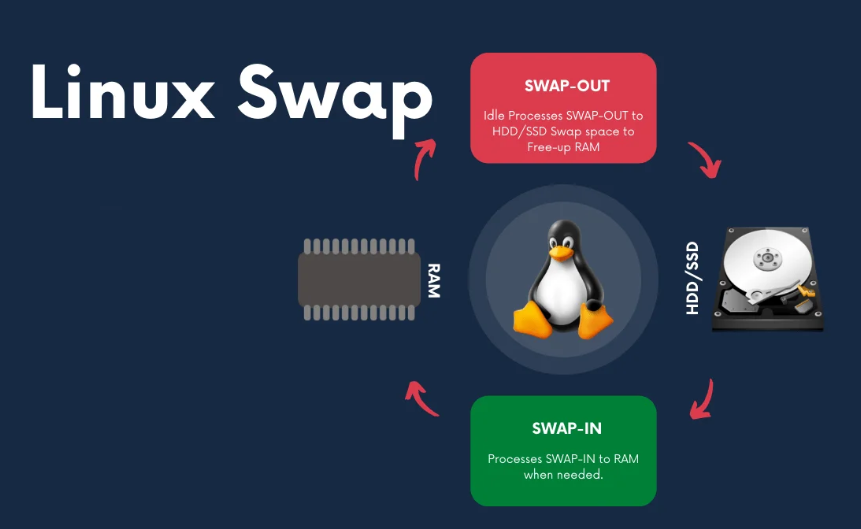

# Linux Sunucularda Swap Kullanım Politikasının Yapılandırılması



Bildiniz üzere Linux sunucularda Swap (Takas) Alanı, işletim sistemi tarafından sabit diskimizde ayrılmış olan bir bölümdür. Sunucumuzdaki proseslerde ram'in yetmediği durumda bu ayrılmış olan bölümü ram gibi kullanır ve işlemlerin devam etmesine yardımcı olur. Fakat diskimizin read/write hızı düşük olacağından dolayı swap alanın kullanıldığında çalışan prosesler yavaşlamaktadır. Sistemimizde sürekli swap alanı kullanılıyorsa  uygulamalarımızda yavaş çalışma gibi sorunlar da meydana gelmektedir. Bazı durumlarda ise sistemizde boşta memory olmasına rağmen swap alanı kullanımasından dolayı izleme sistemlerimizden çeşitli swap kullanım uyarıları alabiliyoruz. Burada yapacağımız swappiness yapılandırması ile swap alanı kullanımının daha geç başlamasını sağlayarak ve memory'den tam performans alınmasını sağlamak.

Kullandığımız distro'ya göre swap kullanımı için bir default politika var ve bu politikaya göre ne kadar ram kullanım olduğunda swap kullanımına geçmesini belirliyoruz. Örneğin 10GB memory'imizin olduğunu düşünelim ve swapiness 10 olarak ayarlandığında memory kullanımı 9GB'a ulaştığında sunucumuz otomatik olarak swap alanı kullanmaya başlayacaktır. Bu değer yüksek olduğunda daha hızlı swap alanı kullanılmaya başlayacaktır.

Sunucumuzda memory kullanımı ne kadar olduğunda swap kullanmaya başladığını aşağıdaki komut ile öğrenip değere bakıyoruz.

```bash
euludag@akf:~$ sysctl -a | grep -i swappiness   
60
```

veya  

```bash
euludag@akf:~$ cat /proc/sys/vm/swappiness
60
```
> [!NOTE|style:flat]
>%60 değeri şu anlama gelmektedir;
>
>10 ise eğer ram %90 kullanılırsa swap alanı kullanımı başlasın.
>
>60 ise eğer ram %40 kullanılırsa swap alanı kullanımı başlasın.
>
>80 ise eğer ram %20 kullanılırsa swap alanı kullanımı başlasın.

Swappiness 0-100 değeri arasında verilmektedir. 0 verilirse disable anlamına gelmektedir. Ubuntu'larda default olarak bu değer %60, Redhat sunucularda %30 olarak gelmektedir. Best practice olarak swap, docker ve kubenetes gibi ortamlarda tamamen kapatılmakta olup Mariadb database sunucularında %1 olarak önerilmektedir.  Ben bu oranı kubernetes ve db ortamları dışında %10 olarak kullanmayı tercih ediyorum. 

# Swappiness Nasıl Değiştirilir

Swapp kullanımı tamamen kapatılır ve sunucu restart edilmesine gerek kalmadan politikayı uygular

```bash
sysctl -w vm.swappiness=0
```

Swapiness %10 olarak ayarlar.

```bash
sysctl -w vm.swappiness=10
```

Yaptığımız değişikliklerin restart sonrası kayıt altına alınması için /etc/sysctl.conf altına parametreleri ekliyoruz.

```bash
echo 'vm.swappiness=10' >> /etc/sysctl.conf
```

Değişiklikleri yaptıktan sonra yukarıda paylaşmış olduğum komut ile kontrol edebiliriz.

`sysctl -a | grep -i swappiness `

# Swap Alanın Boşaltılması 

Kullanılan swap alanı içerisinde bulunan prosesler  memory de yeterli alan mevcut ise memory'e taşınır.

swapoff -a && swapon -a

Swap alanı kullanan prosesleri aşağıdaki komut ile listeleyebilirsiniz.

```bash
echo "COMM PID SWAP"; for file in /proc/*/status ; do awk '/^Pid|VmSwap|Name/{printf $2 " " $3}END{ print ""}' $file; done | grep kB | grep -wv "0 kB" | sort -k 3 -n -r) | column -t
```

```bash
[euludag@akf ~]# (echo "COMM PID SWAP"; for file in /proc/*/status ; do awk '/^Pid|VmSwap|Name/{printf $2 " " $3}END{ print ""}' $file; done | grep kB | grep -wv "0 kB" | sort -k 3 -n -r) | column -t
COMM             PID    SWAP
bash             45060  148   kB
polkitd          1339   128   kB
dockerd-current  26103  120   kB
lvmetad          682    96    kB
python3          41214  76    kB
sh               28249  48    kB
su               25442  20    kB
tuned            1599   8     kB
rhel-push-plugi  2221   4     kB
```

> [!TIP|style:flat]
> 128GB gibi memory kullanan sunucularda uygulamaya göre  128GB da swap alanı verilebilmektedir. Dolayısı ile taşıma işlemi yapılması çok uzun sürebilmektedir. Swap alanının ne kadar sürede boşaltılabileceğini aşağıdaki gibi hesaplayabilirsiniz.
> 
> Swap alanından memory'e 1mbps hızında data transferi yapılmaktadır. Buna göre;
> 
> Örneğin 2048kb büyüklüğü olan proses
> 
> Time = procces size / transfer rate
> 
>           = 2048 / 1024
> 
>           =2 saniye
> 
> yani swap alanından kullanılan 2048kb'lık proses 2sn de memory'e taşınacaktır.