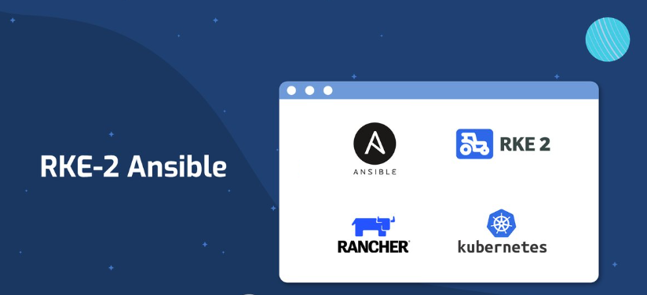

# Ansible İle RKE2 Kubernetes Cluster Kurulumu




Hazırlamış olduğum dokümantasyon ile ansible kullanlarak 3 master 3 worker node'dan oluşan bir kubernetes cluster kurulumu yapacağız. Kurulumu RHEL8.6 üzerinde gerçekleştireceğim. Kurulumda öncelikle tüm node'larda selinux ve swap kapatıyoruz. Daha sonra network için konfigürasyonlar yapılacaktır. İlk master sunucu kurulumu yapılır diğer master ve worker'ların join olabilmesi için gerekli token'i elde edeceğim. Daha sonra sahip olduğumuz token ile diğer node'ların kurulumu yapılacaktır. Node sayılarını arttırmak isterseniz inventory dosyasına eklemeniz yeterlidir.

> RKE2 Kurulumu default olarak /var/lib/rancher dizinine kurulmaktadır. İlgili dizini LVM ile ayırmanızı tavsiye ederim. LVM için notlar bölümünde paylaştım.

> ilgili Yml dosyaları için;
> 
> https://github.com/emrahuludag/rke2-cluster-installation.git

# Dizin Ağaç Yapısı

```bash
.
├── inventory.ini
├── main.yml
├── roles
│   ├── installation
│   │   └── tasks
│   │       ├── install_master.yml
│   │       ├── join_master.yml
│   │       ├── join_worker.yml
│   └── requirements
│       └── tasks
│           └── requirements.yml
└── vars
   └── vars.yml
```

# Playbook Dosyaları

**inventory.ini**

```bash
[allnode:children]
master-firstnode
master-nextnodes
workers

[master-firstnode]
rke2-node1 ansible_host=192.168.1.1

[master-nextnodes]
rke2-node2 ansible_host=192.168.1.2
rke2-node2 ansible_host=192.168.1.3

[workers]
rke2-worker-node1 ansible_host=192.168.1.4
rke2-worker-node2 ansible_host=192.168.1.5
rke2-worker-node3 ansible_host=192.168.1.6

[allnode:vars]
 ansible_user = root
 remote_tmp = /tmp/.ansible-${USER}/tmp
 ansible_python_interpreter=/usr/bin/python3
 ansible_ssh_common_args = "-o StrictHostKeyChecking=no -o UserKnownHostsFile=/dev/null"
```

**vars.yml**

```bash
##Installing ENV
confvar: "/var/lib/rancher/rke2/server"
confdir: "/etc/rancher/rke2"
conffile: "{{ confdir }}/config.yaml"
clustername: "test"
kubeconfig: "/etc/rancher/rke2/rke2.yaml"
```

**requirements.yml**

```bash
---
 - name: Disable SELinux
   selinux:
    state: disabled

 - name: Swapoff
   shell: swapoff -a

 - name: Disable Swap permanently
   replace:
     path: /etc/fstab
     regexp: '^(\s*)([^#\n]+\s+)(\w+\s+)swap(\s+.*)$'
     replace: '#\1\2\3swap\4'
     backup: yes

 - name: Network Requirements
   shell: |
     sudo cat << EOF | sudo tee /etc/modules-load.d/containerd.conf 
     overlay 
     br_netfilter 
     EOF
     sudo cat << EOF | sudo tee /etc/sysctl.d/99-kubernetes-cri.conf 
     net.ipv4.ip_forward = 1 
     net.bridge.bridge-nf-call-iptables = 1 
     net.bridge.bridge-nf-call-ip6tables = 1 
     EOF
     sudo modprobe overlay
     sudo modprobe br_netfilter 
     sudo sysctl --system

 - name: Install Kubernetes Python dependencies
   pip:      
    name: kubernetes
```

**install\_master.yml**

```bash
---
    - name: Create RKE2 Directory
      file:
        path: "{{ confdir }}"
        state: directory
        owner: root
        group: root
        mode: '0770'
        recurse: yes

    - name: Installing RKE2 Server
      shell: |
          curl -sfL https://get.rke2.io |  INSTALL_RKE2_TYPE=server sh -
    
    - name: Start rke2-server service
      service:
        name: rke2-server
        state: started
        enabled: yes 
    
    - name: Simlink kubectl
      shell: |
        ln -s $(find /var/lib/rancher/rke2/data/ -name kubectl) /usr/local/bin/kubectl
      ignore_errors: yes
    
    - name: Append /var/lib/rancher/rke2/bin/ to PATH env
      lineinfile:
        path: /root/.bash_profile
        line: export KUBECONFIG=/etc/rancher/rke2/rke2.yaml
        create: yes
        backup: yes
    
    - name: Create RKE2 config.yaml for joining
      shell: "echo server: https://{{ ansible_host }}:9345 > {{ confvar }}/config.yaml; \
              echo token: $(cat {{ confvar }}/node-token) >> {{ confvar }}/config.yaml"

    - name: Fetch Token From Master
      fetch:
       src: "{{ confvar }}/config.yaml"
       dest: "/tmp/rke2_{{ clustername }}_config.yaml"
       flat: yes
```

**join\_master.yml**

```bash
---
  - name: Create RKE2 Directory
    file:
       path: "{{ confdir }}"
       state: directory
       owner: root
       group: root
       mode: '0770'
       recurse: yes

  - name: Installing RKE2 Server
    shell: |
        curl -sfL https://get.rke2.io |  INSTALL_RKE2_TYPE=server sh -
    

  - name: Copy Master Rancher Config file
    copy:
     src: /tmp/rke2_{{ clustername }}_config.yaml
     dest: /etc/rancher/rke2/config.yaml
     owner: root
     group: root
     mode: '0660'

  - name: Start rke2-server service
    service:
      name: rke2-server
      state: started
      enabled: yes 
  
  - name: Simlink kubectl
    shell: |
      ln -s $(find /var/lib/rancher/rke2/data/ -name kubectl) /usr/local/bin/kubectl
    ignore_errors: yes
  
  - name: Append /var/lib/rancher/rke2/bin/ to PATH env
    lineinfile:
      path: /root/.bash_profile
      line: export KUBECONFIG=/etc/rancher/rke2/rke2.yaml
      create: yes
      backup: yes

```

**join\_worker.yml**

```bash
---
  - name: Create RKE2 Directory
    file:
       path: "{{ confdir }}"
       state: directory
       owner: root
       group: root
       mode: '0770'
       recurse: yes

  - name: Installing RKE2 Agent on Workers
    shell: |
        curl -sfL https://get.rke2.io |  INSTALL_RKE2_TYPE=agent sh -

  - name: Copy Master Rancher Config file
    copy:
     src: /tmp/rke2_{{ clustername }}_config.yaml
     dest: /etc/rancher/rke2/config.yaml
     owner: root
     group: root
     mode: '0660'

  - name: Start rke2-agent service
    service:
      name: rke2-agent
      state: started
      enabled: yes 
  
  - name: Simlink kubectl
    shell: |
      ln -s $(find /var/lib/rancher/rke2/data/ -name kubectl) /usr/local/bin/kubectl
    ignore_errors: yes
  
  - name: Append /var/lib/rancher/rke2/bin/ to PATH env
    lineinfile:
      path: /root/.bash_profile
      line: export KUBECONFIG=/etc/rancher/rke2/rke2.yaml
      create: yes
      backup: yes
```

**main.yml**

```bash
---
- hosts: allnode
  become: yes
  tasks:
    - name: Install requirements (swap,etc,folders)
      include_role:
        name: requirements
        tasks_from: requirements.yml

- hosts: master-firstnode
  become: yes
  tasks:
    - name: Include vars
      include_vars:
        dir: vars

    - name: Install RKE2 Master Server
      include_role:
        name: installation
        tasks_from: install_master.yml     

- hosts: master-nextnodes
  become: yes
  tasks:
    - name: Include vars
      include_vars:
        dir: vars

    - name: Install RKE2 Next Master Nodes
      include_role:
        name: installation
        tasks_from: join_master.yml  

- hosts: workers
  become: yes
  tasks:
    - name: Include vars
      include_vars:
        dir: vars

    - name: Install RKE2 Next Master Nodes
      include_role:
        name: installation
        tasks_from: join_worker.yml  
```

# Playbook Çalıştırılması

Sunuculara ssh\_key ile root erişilir.

> ansible-playbook main.yml -i inventory.ini

**Output**

```bash

PLAY [allnode] ***********************************************************************************************************************************************************

TASK [Gathering Facts] ***************************************************************************************************************************************************
ok: [rke2-worker-node1]
ok: [rke2-worker-node3]
ok: [rke2-worker-node2]
ok: [rke2-node3]
ok: [rke2-node2]
ok: [rke2-node1]

TASK [Install requirements (swap,etc,folders)] ***************************************************************************************************************************
ok: [rke2-worker-node3]
ok: [rke2-node2]
ok: [rke2-worker-node1]
ok: [rke2-worker-node2]
ok: [rke2-node1]
ok: [rke2-node3]

TASK [requirements : Disable SELinux] ************************************************************************************************************************************
ok: [rke2-worker-node3]
ok: [rke2-node2]
ok: [rke2-worker-node1]
ok: [rke2-worker-node2]
ok: [rke2-node1]
ok: [rke2-node3]

TASK [requirements : Swapoff] ********************************************************************************************************************************************
changed: [rke2-worker-node1]
changed: [rke2-node1]
changed: [rke2-node2]
changed: [rke2-node3]
changed: [rke2-worker-node2]
changed: [rke2-worker-node3]

TASK [requirements : Disable Swap permanently] ***************************************************************************************************************************
ok: [rke2-worker-node2]
ok: [rke2-worker-node1]
ok: [rke2-worker-node3]
ok: [rke2-node1]
ok: [rke2-node2]
ok: [rke2-node3]

TASK [requirements : Network Requirements] *******************************************************************************************************************************
changed: [rke2-node1]
changed: [rke2-node2]
changed: [rke2-node3]
changed: [rke2-worker-node1]
changed: [rke2-worker-node2]
changed: [rke2-worker-node3]

TASK [requirements : Install Kubernetes Python dependencies] *************************************************************************************************************
ok: [rke2-node1]
ok: [rke2-worker-node3]
ok: [rke2-worker-node1]
ok: [rke2-worker-node2]
ok: [rke2-node2]

PLAY [master-firstnode] **************************************************************************************************************************************************

TASK [Gathering Facts] ***************************************************************************************************************************************************
ok: [rke2-node1]

TASK [Include vars] ******************************************************************************************************************************************************
ok: [rke2-node1]

TASK [Install RKE2 Master Server] ****************************************************************************************************************************************

TASK [installation : Create RKE2 Directory] ******************************************************************************************************************************
changed: [rke2-node1]

TASK [installation : Installing RKE2 Server] *****************************************************************************************************************************
changed: [rke2-node1]

TASK [installation : Start rke2-server service] **************************************************************************************************************************
changed: [rke2-node1]

TASK [installation : Simlink kubectl] ************************************************************************************************************************************
changed: [rke2-node1]

TASK [installation : Append /var/lib/rancher/rke2/bin/ to PATH env] ******************************************************************************************************
ok: [rke2-node1]

TASK [installation : Create RKE2 config.yaml for joining] ****************************************************************************************************************
changed: [rke2-node1]

TASK [installation : Fetch Token From Master] ****************************************************************************************************************************
changed: [rke2-node1]

PLAY [master-nextnodes] **************************************************************************************************************************************************

TASK [Gathering Facts] ***************************************************************************************************************************************************
ok: [rke2-node2]

TASK [Include vars] ******************************************************************************************************************************************************
ok: [rke2-node2]

TASK [Install RKE2 Next Master Nodes] ************************************************************************************************************************************

TASK [installation : Create RKE2 Directory] ******************************************************************************************************************************
changed: [rke2-node2]

TASK [installation : Installing RKE2 Server] *****************************************************************************************************************************
changed: [rke2-node2]

TASK [installation : Copy Master Rancher Config file] ********************************************************************************************************************
changed: [rke2-node2]

TASK [installation : Start rke2-server service] **************************************************************************************************************************
changed: [rke2-node2]

TASK [installation : Simlink kubectl] ************************************************************************************************************************************
changed: [rke2-node2]

TASK [installation : Append /var/lib/rancher/rke2/bin/ to PATH env] ******************************************************************************************************
ok: [rke2-node2]

PLAY [workers] ***********************************************************************************************************************************************************

TASK [Gathering Facts] ***************************************************************************************************************************************************
ok: [rke2-worker-node1]
ok: [rke2-worker-node2]
ok: [rke2-worker-node3]

TASK [Include vars] ******************************************************************************************************************************************************
ok: [rke2-worker-node1]
ok: [rke2-worker-node2]
ok: [rke2-worker-node3]

TASK [Install RKE2 Next Master Nodes] ************************************************************************************************************************************

TASK [installation : Create RKE2 Directory] ******************************************************************************************************************************
changed: [rke2-worker-node2]
changed: [rke2-worker-node3]
changed: [rke2-worker-node1]

TASK [installation : Installing RKE2 Agent on Workers] *******************************************************************************************************************
changed: [rke2-worker-node1]
changed: [rke2-worker-node2]
changed: [rke2-worker-node3]

TASK [installation : Copy Master Rancher Config file] ********************************************************************************************************************
changed: [rke2-worker-node1]
changed: [rke2-worker-node2]
changed: [rke2-worker-node3]

TASK [installation : Start rke2-agent service] ***************************************************************************************************************************
changed: [rke2-worker-node3]
changed: [rke2-worker-node2]
changed: [rke2-worker-node1]

TASK [installation : Simlink kubectl] ************************************************************************************************************************************
changed: [rke2-worker-node1]
changed: [rke2-worker-node2]
changed: [rke2-worker-node3]

TASK [installation : Append /var/lib/rancher/rke2/bin/ to PATH env] ******************************************************************************************************
ok: [rke2-worker-node1]
ok: [rke2-worker-node3]
ok: [rke2-worker-node2]

PLAY RECAP ***************************************************************************************************************************************************************
rke2-node1                 : ok=15   changed=8    unreachable=0    failed=0    skipped=0    rescued=0    ignored=0   
rke2-node2                 : ok=14   changed=7    unreachable=0    failed=0    skipped=0    rescued=0    ignored=0   
rke2-node3                 : ok=14   changed=7    unreachable=0    failed=0    skipped=0    rescued=0    ignored=0   
rke2-worker-node1          : ok=14   changed=7    unreachable=0    failed=0    skipped=0    rescued=0    ignored=0   
rke2-worker-node2          : ok=14   changed=7    unreachable=0    failed=0    skipped=0    rescued=0    ignored=0   
rke2-worker-node3          : ok=14   changed=7    unreachable=0    failed=0    skipped=0    rescued=0    ignored=0 
```

```bash
[root@akfrancherm01 ~]# kubectl get nodes
NAME            STATUS   ROLES                       AGE     VERSION
akfrancherm01   Ready    control-plane,etcd,master   10m     v1.24.7+rke2r1
akfrancherm02   Ready    control-plane,etcd,master   7m45s   v1.24.7+rke2r1
akfrancherm03   Ready    control-plane,etcd,master   7m41s   v1.24.7+rke2r1

akkrancherw01   Ready    <none>                      5m49s   v1.24.7+rke2r1
akfrancherw02   Ready    <none>                      5m50s   v1.24.7+rke2r1
akfrancherw03   Ready    <none>                      5m52s   v1.24.7+rke2r1
```

# NOTLAR

Node'u silmeniz gerekmesi durumunda aşağıdaki hazır script ile temizleyebilirsiniz. BKZ: https://docs.rke2.io/install/linux\_uninstall/

```bash
 /usr/bin/rke2-uninstall.sh 
 #
 rm -rf /usr/local/bin/kubectl
```

**LVM ile /var/lib/rancher dizinin ayrılması**

```bash
pvcreate /dev/sdb
#
vgcreate -s 16m rancher_vg /dev/sdb
#
lvcreate -L 100%FREE  -n rancher_lv rancher_vg
#
mkfs.xfs /dev/mapper/rancher_vg-rancher_lv
#
mkdir -p /var/lib/rancher
#
echo "####################################################################" >> /etc/fstab
#
echo "/dev/mapper/rancher_vg-rancher_lv /var/lib/rancher                   xfs     defaults        0 0" >> /etc/fstab
#
mount /var/lib/rancher
#
```