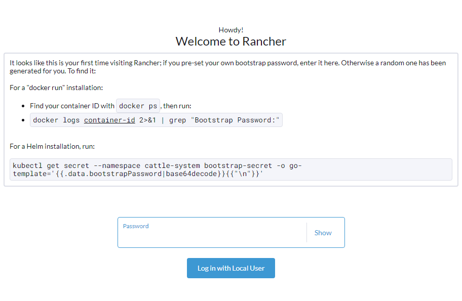

# Ansible İle RKE2 Kubernetes Cluster Üzerinde Rancher UI Kurulumu


Bir önceki [Ansible İle RKE2 Cluster Kurulumu](rancher/rke2clusterinstall.md)  yapmıştık. Bu yazımızda ise oluşturduğumuz rke2 kubernetes cluster üzerinde UI kurulumu yapıyor olacağız.

# Yapılacaklar

1.  Helm Package Manager kurulacak
2.  Rancher ve Cert Manager Repoları Eklenecek
3.  Cert Manager Kurulumu Yapılacak
4.  Rancher Kurulumu Yapılacak

# Playbook Dosyaları

**Inventory.ini**

```bash
[nodes]
rke2-node1 ansible_host=192.168.1.2

[nodes:vars]
  ansible_user = root
  remote_tmp = /tmp/.ansible-${USER}/tmp
  ansible_python_interpreter = auto
  ansible_ssh_common_args = "-o StrictHostKeyChecking=no -o UserKnownHostsFile=/dev/null"
```

**vars.yml**

```bash
##Installing ENV
confvar: "/var/lib/rancher/rke2/server"
confdir: "/etc/rancher/rke2"
conffile: "{{ confdir }}/config.yaml"
clustername: "test"
kubeconfig: "~/etc/rancher/rke2/rke2.yaml"


##UI ENV
helm: "raw.githubusercontent.com/helm/helm/master/scripts/get-helm-3"
helm_repo: "https://releases.rancher.com/server-charts/stable"
jetstack_repo: "https://charts.jetstack.io"
cert_manager: "https://github.com/jetstack/cert-manager/releases/download/v1.6.1/cert-manager.crds.yaml"
jetstack: "https://charts.jetstack.io"
rancher_domain: "rancher.acikkaynakfikirler.com"
rancher_password: "test1"
```

main.yml

```bash
---
- hosts: nodes
  become: yes
  tasks:
    - name: Include vars
      include_vars:
        dir: vars
   
    - name: Install HELM v3
      shell: 'curl -sLk raw.githubusercontent.com/helm/helm/master/scripts/get-helm-3 | sh'
   
    - name: Add Helm Repository
      kubernetes.core.helm_repository:
        name: rancher-stable
        repo_url: "{{ helm_repo }}"
    
    - name: Add Jetstack Repository
      kubernetes.core.helm_repository:
        name: jetstack
        repo_url: "{{ jetstack_repo }}"

    - name: Download Cert-Manager manifest to the cluster.
      ansible.builtin.get_url:
       url: "{{ cert_manager }}"
       dest: ~/cert-manager.yaml
       mode: '0664'

    - name: Apply Cert-Manager manifest to the cluster.
      kubernetes.core.k8s:
       state: present
       src: ~/cert-manager.yaml
       kubeconfig: "{{ kubeconfig }}"
     
    - name: Installing Cert-Manager
      kubernetes.core.helm:
          name: cert-manager
          chart_ref: jetstack/cert-manager
          release_namespace: cert-manager
          #chart_version:  "{{ cert_version }}"
          create_namespace: true
          update_repo_cache: true 
          disable_hook: true
          wait_timeout: 30s
          kubeconfig: "{{ kubeconfig }}"
   
    - name: Wait for the Cert-Manager pods to come up with status 'Running'
      kubernetes.core.k8s_info:
        kind: Pod
        namespace: cert-manager
        field_selectors:
          - status.phase=Running
        kubeconfig: "{{ kubeconfig }}"
        wait: True
   
    - name: Installing Rancher UI
      kubernetes.core.helm:
       name: rancher
       chart_ref: rancher-stable/rancher
       release_namespace: cattle-system
       create_namespace: true
       update_repo_cache: true
       kubeconfig: "{{ kubeconfig }}"
       values:
        replicas: 1
        hostname: "{{ rancher_domain }}"
        bootstrapPassword: "{{ rancher_password }}"
       #wait_timeout: 40s
       wait: True

      register: rancher_installation
    
    - when: rancher_installation.changed
      debug:
        msg: "Rancher UI Installation Completed" 
  
```

# Playbook Çalıştırılması

```bash
ansible-playbook main.yml -i inventory.ini
```

```bash
PLAY [nodes] *******************************************************************

TASK [Gathering Facts] *********************************************************
changed: [rke2-node1]

TASK [Include vars] ************************************************************
changed: [rke2-node1]

TASK [Install HELM v3] *********************************************************
changed: [rke2-node1]

TASK [Add Helm Repository] *****************************************************
changed: [rke2-node1]

TASK [Add Jetstack Repository] *************************************************
changed: [rke2-node1]

TASK [Download Cert-Manager manifest to the cluster.] **************************
changed: [rke2-node1]

TASK [Apply Cert-Manager manifest to the cluster.] *****************************
changed: [rke2-node1]

TASK [Installing Cert-Manager] *************************************************
changed: [rke2-node1]

TASK [Wait for the Cert-Manager pods to come up with status 'Running'] *********
changed: [rke2-node1]

TASK [Installing Rancher UI] ***************************************************
changed: [rke2-node1]

TASK [debug] *******************************************************************
ok: [rke2-node1] => 
  msg: Rancher UI Installation Completed

PLAY RECAP *********************************************************************
rke2-node1                 : ok=1   changed=14    unreachable=0    failed=0    skipped=0    rescued=0    ignored=0   
```



Vars.yml dosyası içerisinde rancher için belirlediğimiz parola ile giriş yapabilirsiniz.

# Notlar

Ansibile kubernetes.core modulünü kullanabimesi için bazı library'lere ihtiyaç duymakta ve kullandığınız OS'de minimum Python 3.6+ olmalı.  Yüklemek için; 

```bash
ansible-galaxy collection install community.kubernetes
ansible-galaxy collection install kubernetes.core
```

Daha fazla bilgi için;

https://galaxy.ansible.com/kubernetes/core

https://docs.ansible.com/ansible/latest/collections/kubernetes/core/helm\_module.html

https://docs.ansible.com/ansible/latest/collections/kubernetes/core/index.html